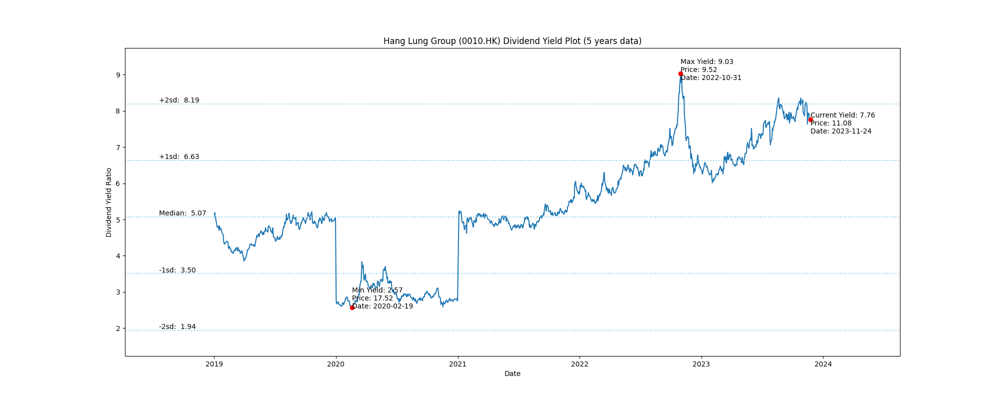
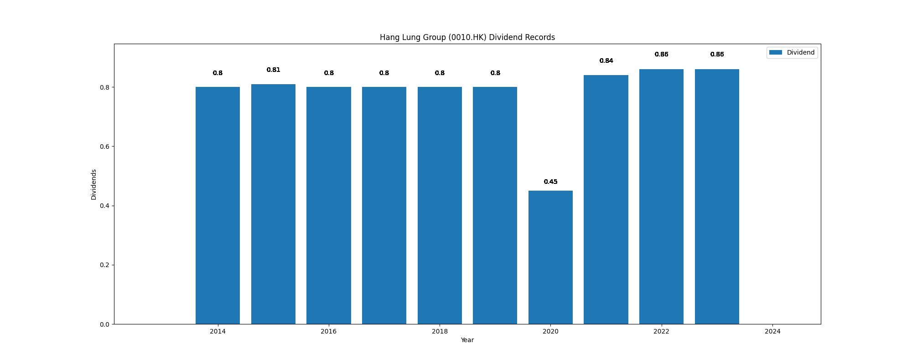

# Hang Lung Group (0010.HK) Dividend Yield (5 years data)

|     | Yield   | Price | Date       |
|-----|---------|-------|------------|
| Target | 8.16 |  |  |
| Current | 8.24 | 10.44  | 2023-11-10 |
| Max | 9.03 | 9.52  | 2022-10-31 |
| Min | 2.57 | 17.52  | 2020-02-19 |

