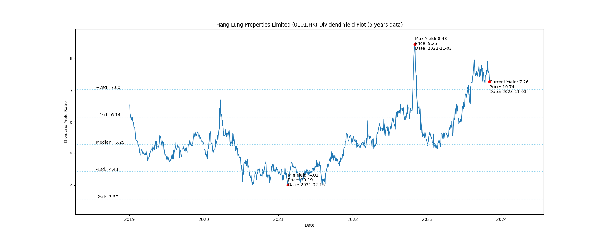
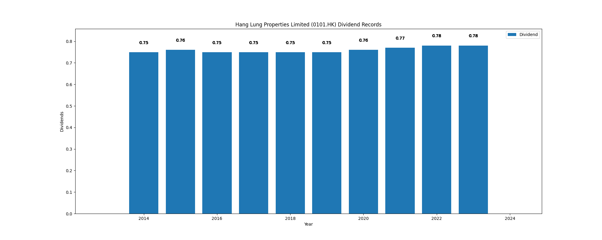

# Hang Lung Properties Limited (0101.HK) Dividend Yield (5 years data)

|     | Yield   | Price | Date       |
|-----|---------|-------|------------|
| Target | 7.03 |  |  |
| Current | 7.57 | 10.30  | 2023-11-10 |
| Max | 8.43 | 9.25  | 2022-11-02 |
| Min | 4.01 | 19.19  | 2021-02-16 |

