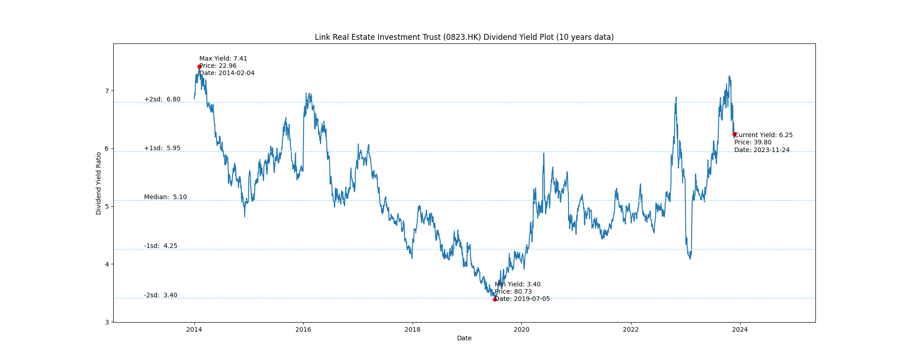
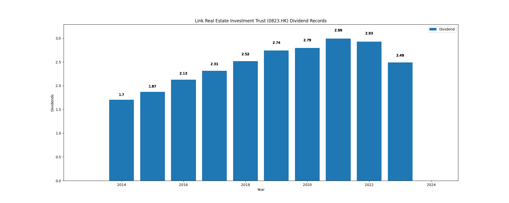

# Link Real Estate Investment Trust (0823.HK) Dividend Yield (10 years data)

|     | Yield   | Price | Date       |
|-----|---------|-------|------------|
| Target | 6.80 |  |  |
| Current | 6.25 | 39.80  | 2023-11-24 |
| Max | 7.41 | 22.96  | 2014-02-04 |
| Min | 3.40 | 80.73  | 2019-07-05 |

