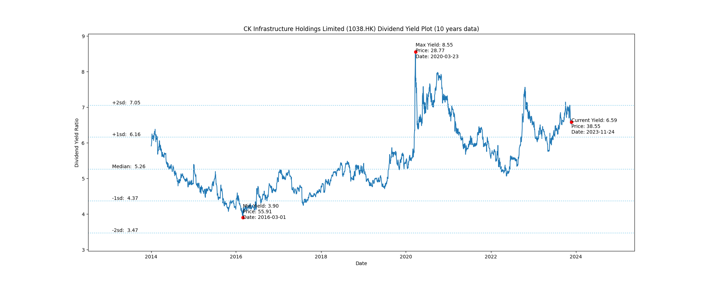

# CK Infrastructure Holdings Limited (1038.HK) Dividend Yield (10 years data)

|     | Yield   | Price | Date       |
|-----|---------|-------|------------|
| Target | 7.04 |  |  |
| Current | 7.01 | 36.25  | 2023-10-31 |
| Max | 8.55 | 28.77  | 2020-03-23 |
| Min | 3.90 | 55.91  | 2016-03-01 |

