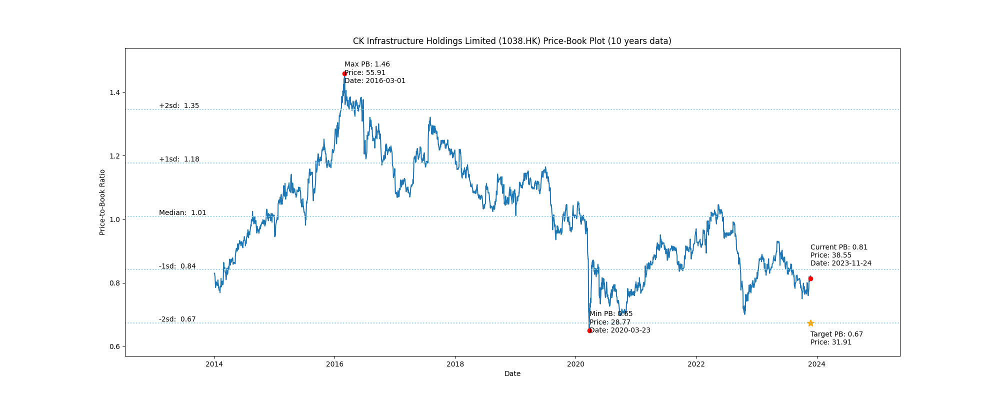
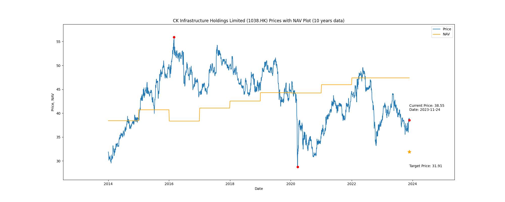

# CK Infrastructure Holdings Limited (1038.HK) Price-Book (10 years data)

|     | PB   | Price | Date       |
|-----|------|-------|------------|
| Target | 0.67 | 31.91  |  |
| Current | 0.81 | 38.55  | 2023-11-24 |
| Min | 0.65 | 28.77  | 2020-03-23 |
| Max | 1.46 | 55.91  | 2016-03-01 |

Last updated: 2023-11-24

