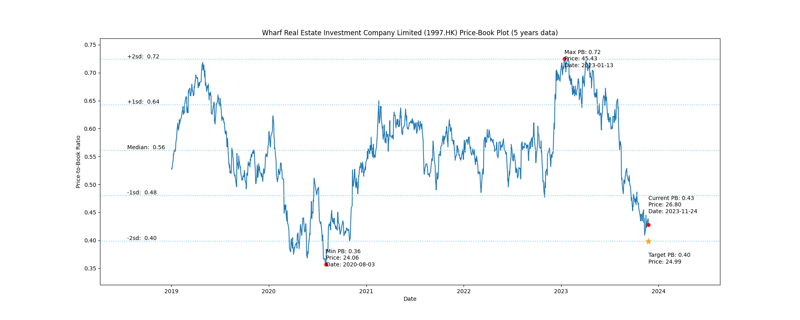

# Wharf Real Estate Investment Company Limited (1997.HK) Price-Book (5 years data)

|     | PB   | Price | Date       |
|-----|------|-------|------------|
| Target | 0.40 | 24.99  |  |
| Current | 0.43 | 26.80  | 2023-11-24 |
| Min | 0.36 | 24.06  | 2020-08-03 |
| Max | 0.72 | 45.43  | 2023-01-13 |

Last updated: 2023-11-24

