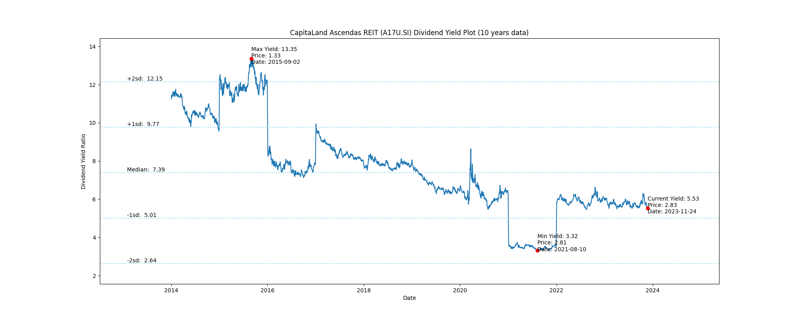
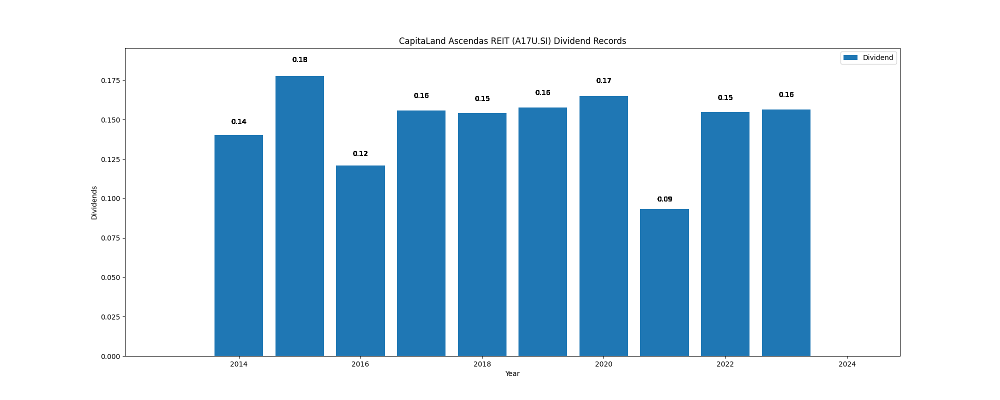

# CapitaLand Ascendas REIT (A17U.SI) Dividend Yield (10 years data)

|     | Yield   | Price | Date       |
|-----|---------|-------|------------|
| Target | 12.15 |  |  |
| Current | 5.53 | 2.83  | 2023-11-24 |
| Max | 13.35 | 1.33  | 2015-09-02 |
| Min | 3.32 | 2.81  | 2021-08-10 |

