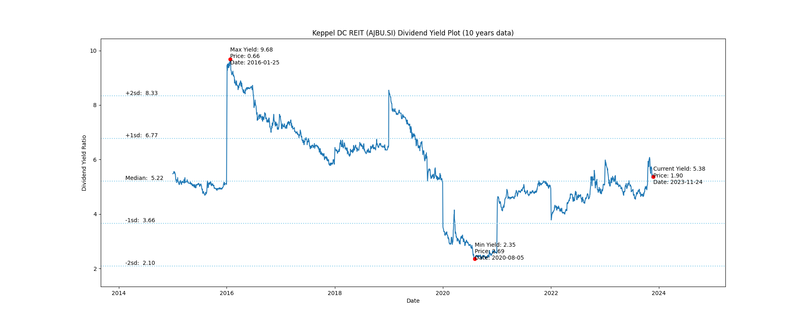
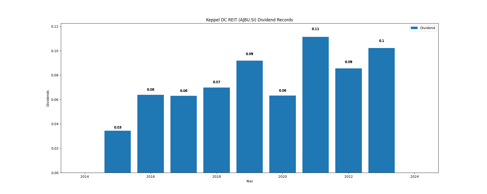

# Keppel DC REIT (AJBU.SI) Dividend Yield (10 years data)

|     | Yield   | Price | Date       |
|-----|---------|-------|------------|
| Target | 8.33 |  |  |
| Current | 5.38 | 1.90  | 2023-11-24 |
| Max | 9.68 | 0.66  | 2016-01-25 |
| Min | 2.35 | 2.69  | 2020-08-05 |

