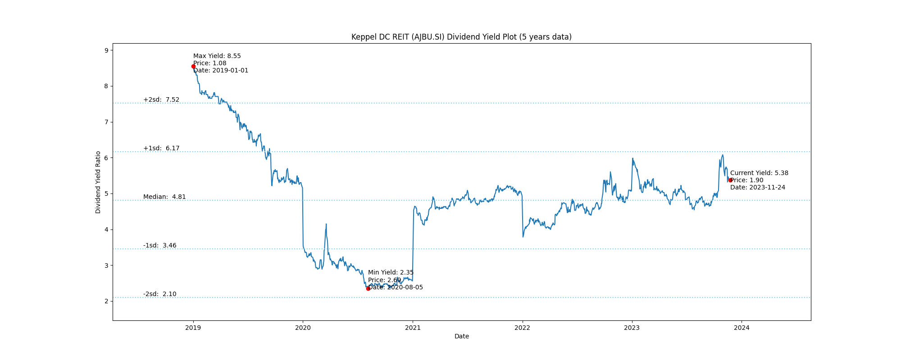
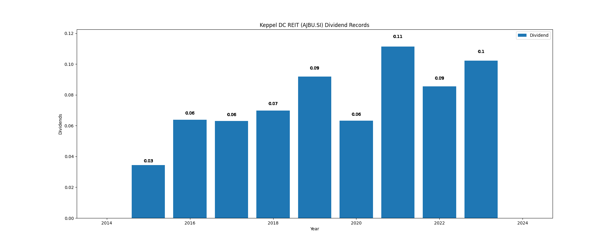

# Keppel DC REIT (AJBU.SI) Dividend Yield (5 years data)

|     | Yield   | Price | Date       |
|-----|---------|-------|------------|
| Target | 7.52 |  |  |
| Current | 5.74 | 1.78  | 2023-11-10 |
| Max | 8.55 | 1.08  | 2019-01-01 |
| Min | 2.35 | 2.69  | 2020-08-05 |

