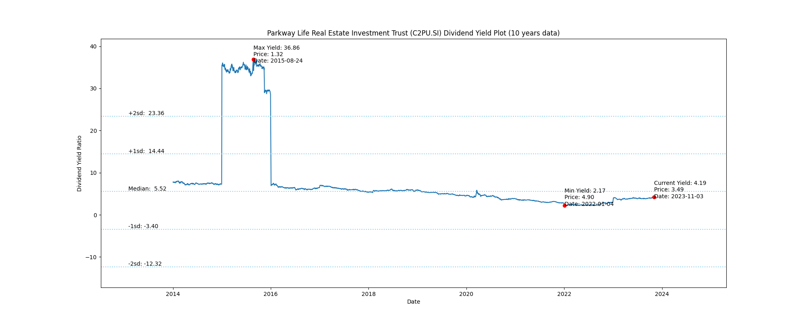
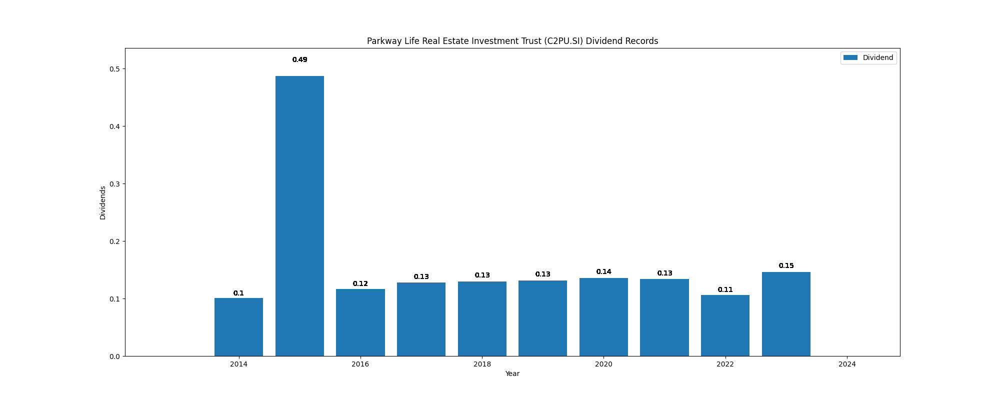

# Parkway Life Real Estate Investment Trust (C2PU.SI) Dividend Yield (10 years data)

|     | Yield   | Price | Date       |
|-----|---------|-------|------------|
| Target | 23.34 |  |  |
| Current | 4.22 | 3.46  | 2023-11-10 |
| Max | 36.86 | 1.32  | 2015-08-24 |
| Min | 2.17 | 4.90  | 2022-01-04 |

