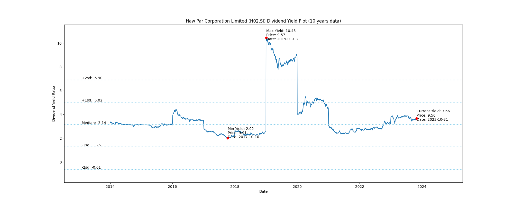

# Haw Par Corporation Limited (H02.SI) Dividend Yield (10 years data)

|     | Yield   | Price | Date       |
|-----|---------|-------|------------|
| Target | 6.90 |  |  |
| Current | 3.66 | 9.56  | 2023-10-31 |
| Max | 10.45 | 9.57  | 2019-01-03 |
| Min | 2.02 | 9.91  | 2017-10-10 |

