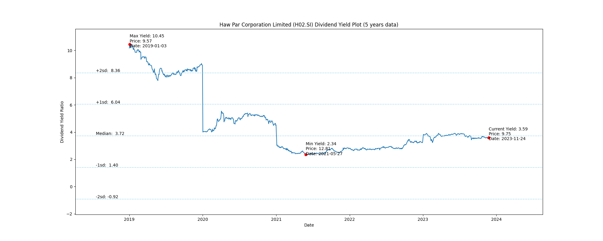

# Haw Par Corporation Limited (H02.SI) Dividend Yield (5 years data)

|     | Yield   | Price | Date       |
|-----|---------|-------|------------|
| Target | 8.37 |  |  |
| Current | 3.57 | 9.81  | 2023-11-10 |
| Max | 10.45 | 9.57  | 2019-01-03 |
| Min | 2.34 | 12.81  | 2021-05-27 |

