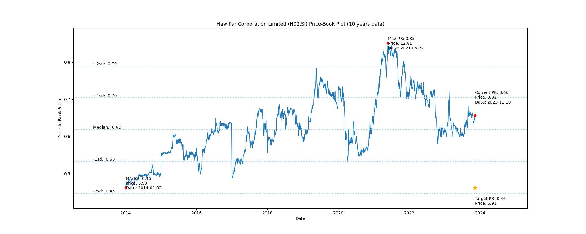
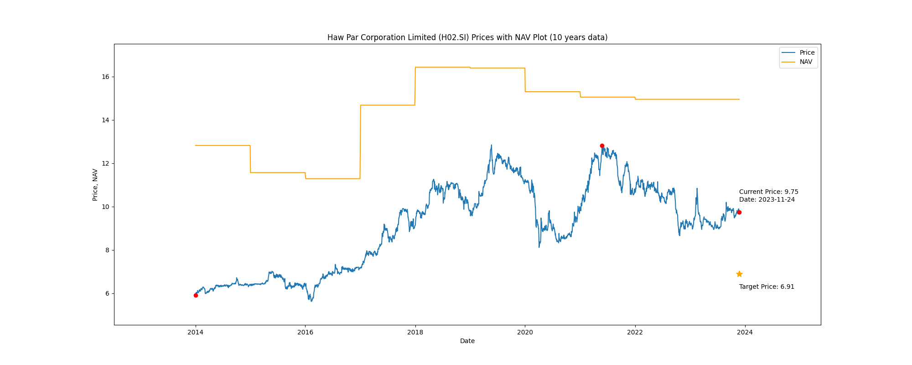

# Haw Par Corporation Limited (H02.SI) Price-Book (10 years data)

|     | PB   | Price | Date       |
|-----|------|-------|------------|
| Target | 0.46 | 6.91  |  |
| Current | 0.64 | 9.56  | 2023-10-31 |
| Min | 0.46 | 5.93  | 2014-01-02 |
| Max | 0.85 | 12.81  | 2021-05-27 |

Last updated: 2023-10-31

