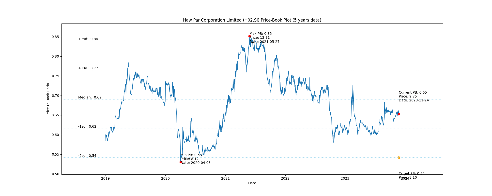
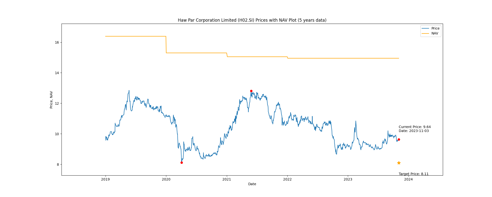

# Haw Par Corporation Limited (H02.SI) Price-Book (5 years data)

|     | PB   | Price | Date       |
|-----|------|-------|------------|
| Target | 0.54 | 8.11  |  |
| Current | 0.64 | 9.64  | 2023-11-03 |
| Min | 0.53 | 8.12  | 2020-04-03 |
| Max | 0.85 | 12.81  | 2021-05-27 |

Last updated: 2023-11-03

