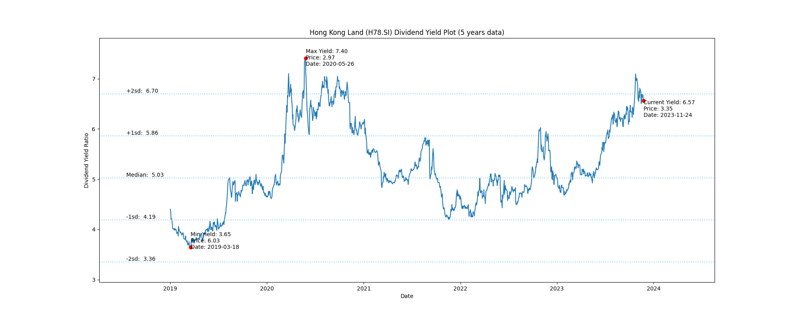

# Hong Kong Land (H78.SI) Dividend Yield (5 years data)

|     | Yield   | Price | Date       |
|-----|---------|-------|------------|
| Target | 6.66 |  |  |
| Current | 6.94 | 3.17  | 2023-10-31 |
| Max | 7.40 | 2.97  | 2020-05-26 |
| Min | 3.65 | 6.03  | 2019-03-18 |

