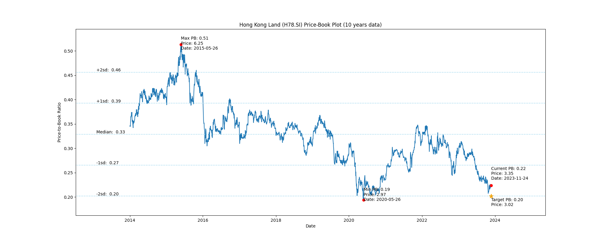

# Hong Kong Land (H78.SI) Price-Book (10 years data)

|     | PB   | Price | Date       |
|-----|------|-------|------------|
| Target | 0.20 | 3.03  |  |
| Current | 0.22 | 3.23  | 2023-11-10 |
| Min | 0.19 | 2.97  | 2020-05-26 |
| Max | 0.51 | 6.25  | 2015-05-26 |

Last updated: 2023-11-10

