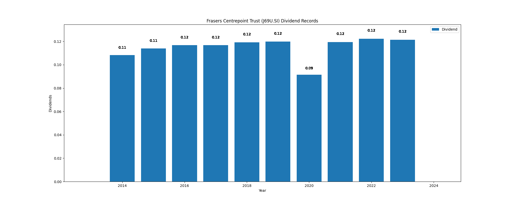

# Frasers Centrepoint Trust (J69U.SI) Dividend Yield (10 years data)

|     | Yield   | Price | Date       |
|-----|---------|-------|------------|
| Target | 10.09 |  |  |
| Current | 5.81 | 2.09  | 2023-11-03 |
| Max | 10.92 | 0.99  | 2014-02-04 |
| Min | 3.65 | 2.50  | 2020-03-05 |

