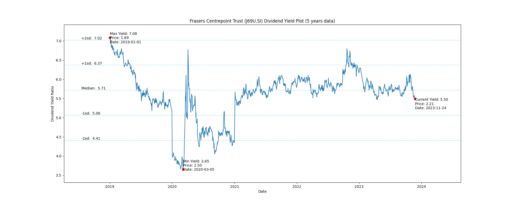

# Frasers Centrepoint Trust (J69U.SI) Dividend Yield (5 years data)

|     | Yield   | Price | Date       |
|-----|---------|-------|------------|
| Target | 7.03 |  |  |
| Current | 5.81 | 2.09  | 2023-11-03 |
| Max | 7.08 | 1.69  | 2019-01-01 |
| Min | 3.65 | 2.50  | 2020-03-05 |

