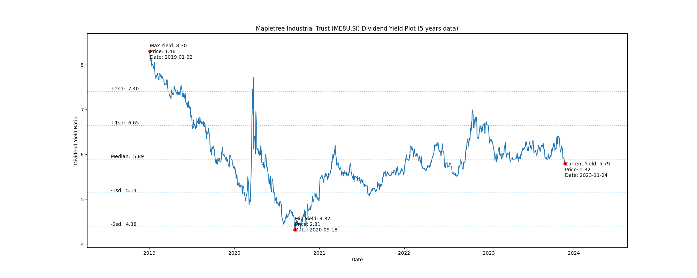

# Mapletree Industrial Trust (ME8U.SI) Dividend Yield (5 years data)

|     | Yield   | Price | Date       |
|-----|---------|-------|------------|
| Target | 7.41 |  |  |
| Current | 6.19 | 2.17  | 2023-11-10 |
| Max | 8.30 | 1.46  | 2019-01-02 |
| Min | 4.32 | 2.81  | 2020-09-18 |

