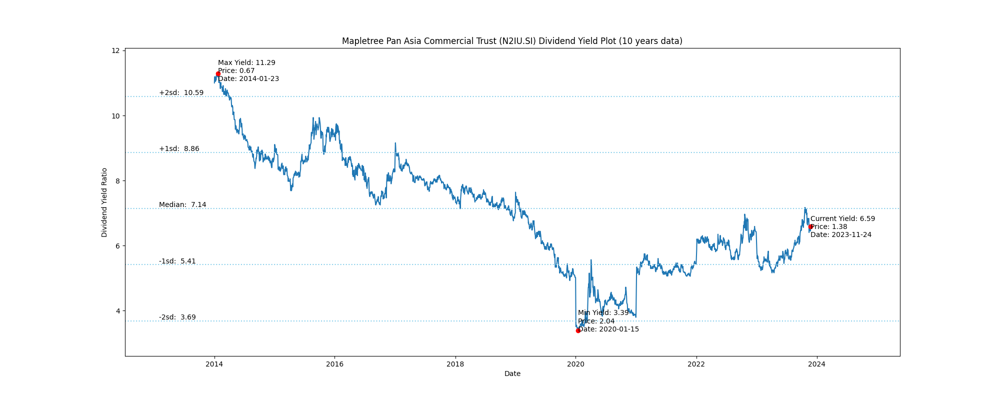
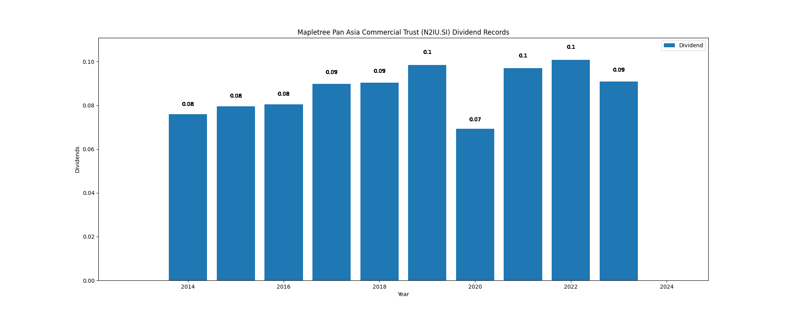

# Mapletree Pan Asia Commercial Trust (N2IU.SI) Dividend Yield (10 years data)

|     | Yield   | Price | Date       |
|-----|---------|-------|------------|
| Target | 10.59 |  |  |
| Current | 6.59 | 1.38  | 2023-11-24 |
| Max | 11.29 | 0.67  | 2014-01-23 |
| Min | 3.39 | 2.04  | 2020-01-15 |

