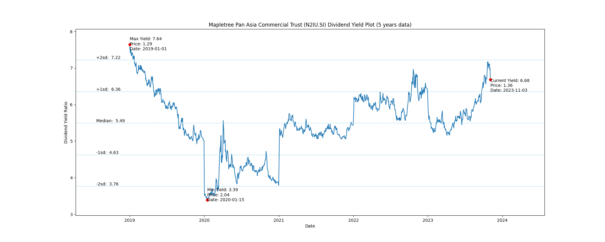
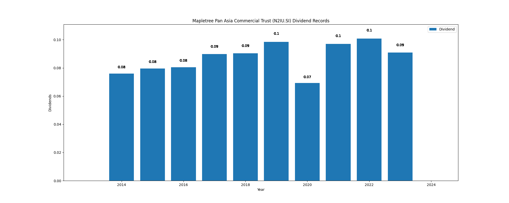

# Mapletree Pan Asia Commercial Trust (N2IU.SI) Dividend Yield (5 years data)

|     | Yield   | Price | Date       |
|-----|---------|-------|------------|
| Target | 7.22 |  |  |
| Current | 6.68 | 1.36  | 2023-11-03 |
| Max | 7.64 | 1.29  | 2019-01-01 |
| Min | 3.39 | 2.04  | 2020-01-15 |

