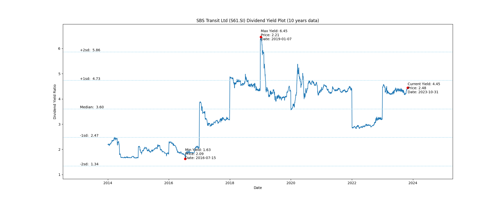
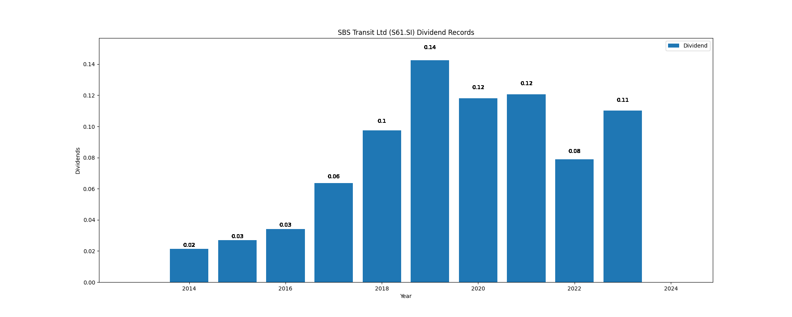

# SBS Transit Ltd (S61.SI) Dividend Yield (10 years data)

|     | Yield   | Price | Date       |
|-----|---------|-------|------------|
| Target | 5.90 |  |  |
| Current | 4.33 | 2.55  | 2023-11-24 |
| Max | 6.45 | 2.21  | 2019-01-07 |
| Min | 1.63 | 2.09  | 2016-07-15 |

