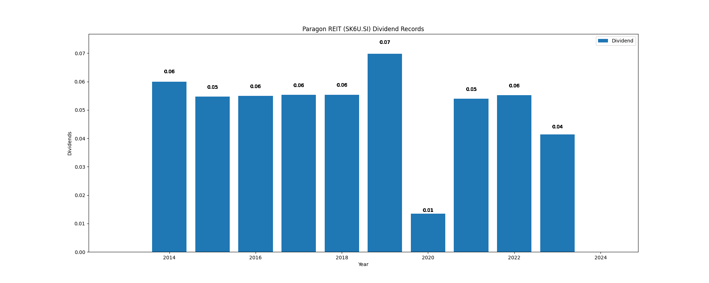

# Paragon REIT (SK6U.SI) Dividend Yield (10 years data)

|     | Yield   | Price | Date       |
|-----|---------|-------|------------|
| Target | 10.31 |  |  |
| Current | 5.02 | 0.83  | 2023-11-03 |
| Max | 10.31 | 0.58  | 2014-01-02 |
| Min | 1.44 | 0.93  | 2020-01-20 |

