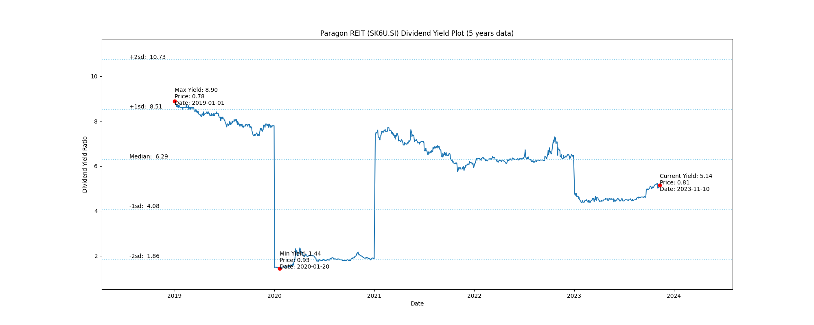
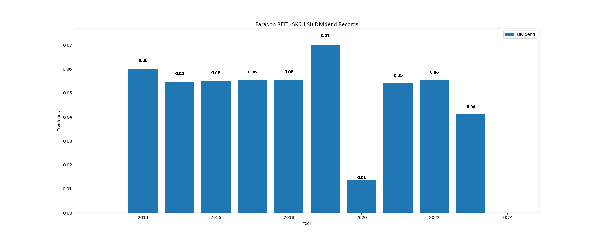

# Paragon REIT (SK6U.SI) Dividend Yield (5 years data)

|     | Yield   | Price | Date       |
|-----|---------|-------|------------|
| Target | 8.90 |  |  |
| Current | 5.21 | 0.80  | 2023-10-31 |
| Max | 8.90 | 0.78  | 2019-01-01 |
| Min | 1.44 | 0.93  | 2020-01-20 |

