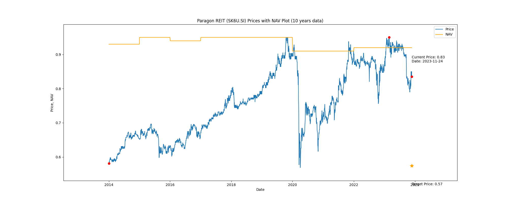

# Paragon REIT (SK6U.SI) Price-Book (10 years data)

|     | PB   | Price | Date       |
|-----|------|-------|------------|
| Target | 0.62 | 0.57  |  |
| Current | 0.88 | 0.81  | 2023-11-10 |
| Min | 0.62 | 0.58  | 2014-01-02 |
| Max | 1.03 | 0.95  | 2023-02-28 |

Last updated: 2023-11-10

