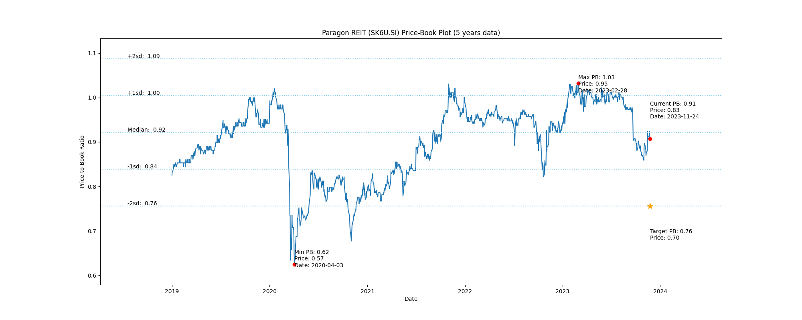

# Paragon REIT (SK6U.SI) Price-Book (5 years data)

|     | PB   | Price | Date       |
|-----|------|-------|------------|
| Target | 0.76 | 0.70  |  |
| Current | 0.91 | 0.83  | 2023-11-24 |
| Min | 0.62 | 0.57  | 2020-04-03 |
| Max | 1.03 | 0.95  | 2023-02-28 |

Last updated: 2023-11-24

